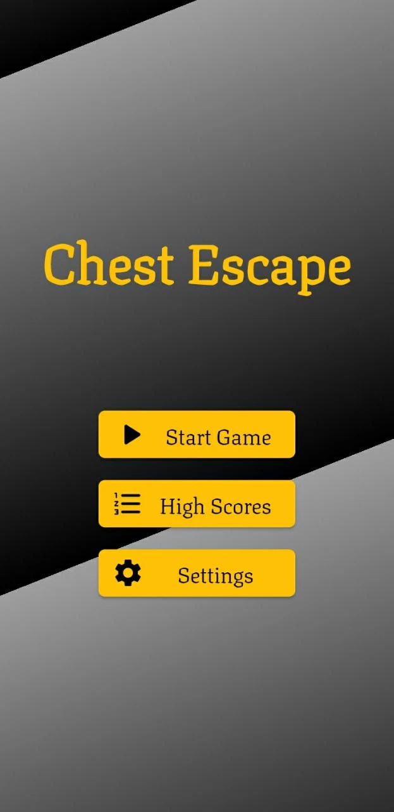

# Chest Escape

Chest Escape is an exciting game where your goal is to escape from the boxes that are rapidly approaching you. As you progress through the levels, the challenge intensifies, with more boxes appearing on the screen. The final level presents the ultimate challenge, as there is only one space available for you to escape from the incoming boxes.

## Tech Stack

- Dart
- Flutter
- Flame Engine

## Pages

The game consists of the following pages:

1. Gameplay view: This is where the action takes place. You will see the boxes approaching and need to maneuver your way to avoid them. The gameplay view provides an immersive and engaging experience.

2. High scores: Here, you can view the highest scores achieved by players. Compete with others to see who can escape the most boxes and secure a top position on the leaderboard.

3. Settings: Customize the game according to your preferences in the settings page. Adjust sound effects or background music to enhance your gaming experience.

## Installation and Usage

To install and run Chest Escape on your device, follow these steps:

1. Make sure you have Dart and Flutter installed on your system.
2. Clone the repository:
```git clone <repository_url>```
3. Navigate to the project directory:
```cd chest_escape```
4. Install the dependencies:
```flutter pub get```
5. Run the game:
```flutter run```


## Screenshots

   

## Google Play Store

You can download Chest Escape from the [Google Play Store](https://play.google.com/store/apps/details?id=com.charilab.chest_escape) to play it on your Android device.


## Contributions

Contributions to Chest Escape are welcome! If you encounter any bugs or have suggestions for new features, please open an issue in the GitHub repository. Additionally, you can submit pull requests to contribute code improvements.
